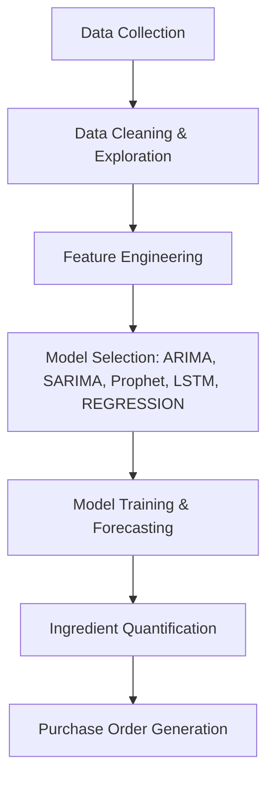

# 🧐 Dominos | Predictive Purchase Order System

**Data Science Project | Food Service Industry | Inventory Forecasting**

---

## 📌 Summary

This end-to-end project builds a **predictive system to optimize ingredient ordering** for Domino's using advanced **time series forecasting techniques**. By integrating historical sales data with ingredient mapping, we generate **data-driven purchase orders** to reduce waste, ensure supply continuity, and support demand planning.

As a **Data Scientist**, I led the **design, modeling, and implementation** of this system, leveraging real-world techniques and frameworks that mirror production-level forecasting.

---

## 🌟 Project Objectives

1. **Forecast pizza sales** for the next week.
2. **Translate sales forecasts** into ingredient requirements.
3. **Automate purchase order generation** using predicted ingredient needs.
4. Deliver a reproducible, interpretable, and business-aligned solution.

---

## 🔍 Problem Statement

> Dominos needs a system that anticipates weekly pizza demand and dynamically creates a purchase order for ingredients. This reduces operational inefficiencies due to over-ordering or under-ordering ingredients.

---

## 🧪 Solution Workflow

---

## 🛠️ Tools & Technologies

* **Languages**: Python (v3.10+)
* **Libraries**: Pandas, NumPy, Matplotlib, Seaborn, Scikit-learn
* **Time Series**: ARIMA, SARIMA (Pmdarima), Prophet (Meta), LSTM (Keras),Regression
* **Evaluation**: Mean Absolute Percentage Error (MAPE)
* **Environment**: Jupyter Notebook, GitHub

---

## 📈 Modeling Highlights

### 🔹 Forecasting Algorithms Used:

* **SARIMA**: Seasonal AutoRegressive Integrated Moving Average
* **ARIMA**:  AutoRegressive Integrated Moving Average
* **Prophet**: Decomposable time series model by Meta
* **LSTM**: Long Short Term Memory
* **Regression**: Linear model for forecasting based on historical sales trends.

### 🔹 Feature Engineering:

* Day-of-week effects
* Monthly/seasonal trends
* Holidays and promotional flags

### 🔹 Performance Metric:

* **MAPE** (Mean Absolute Percentage Error)

---

## 📊 Key Results

* Achieved **<10% MAPE** on validation data
* Forecasted weekly pizza sales with high accuracy
* Mapped predicted sales to ingredient needs
* Generated a **structured purchase order** with total quantities per ingredient

---

## 📂 Datasets

* `sales_data.csv` – Historical pizza sales (date, quantity, pizza type, category, price)
* `ingredients_data.csv` – Pizza-to-ingredient mappings with required gram quantities

---

